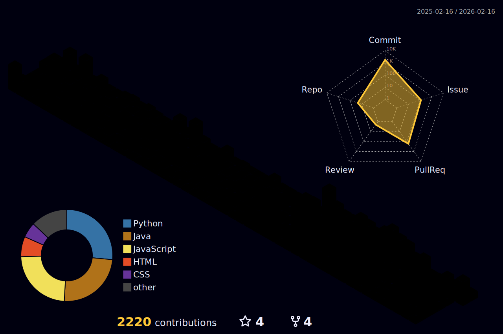

<h3 align="center">Tech Stack</h3>

**Backend** &nbsp;&nbsp; 

**Cloud** &nbsp;&nbsp; 

**Etc** &nbsp;&nbsp; 

---

<h3 align="center">Projects</h3>

  
  

---

<h3 align="center">GitHub Stats</h3>

<!-- 3D Contribution (워크플로우 실행 후 표시됨) -->

  

---

  

